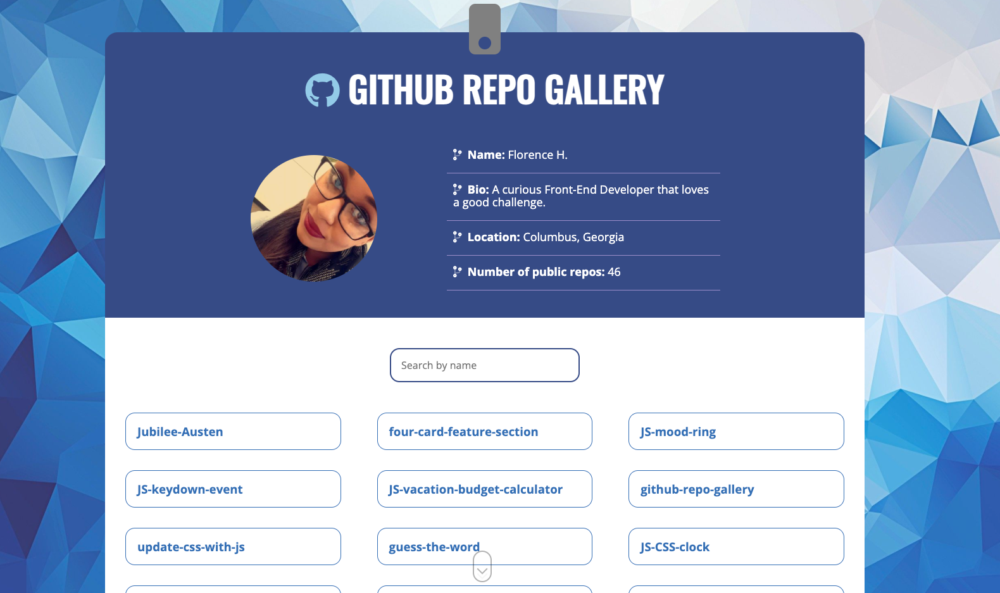

# github-repo-gallery
This is a website that displays the most recent 100 repos from my GitHub Profile. 

## Table of contents

- [Overview](#overview)
  - [The challenge](#the-challenge)
  - [Screenshot](#screenshot)
  - [Links](#links)
- [My process](#my-process)
  - [Built with](#built-with)
  - [What I learned](#what-i-learned)
  - [Continued development](#continued-development)
  - [Useful resources](#useful-resources)
- [Author](#author)
- [Acknowledgments](#acknowledgments)

## Overview
I created a GitHub Repo Gallery as a part of my JavaScript milestone project. This project uses  the GitHub API to pull data from my account to populate name, bio, location, and the number of public repos. 

### The challenge

Users should be able to:

- Use dynamic search functionality to search for my repo names.
- Click on repo to see more information and get a link to the repo on GitHub.
- Go back to repo gallery to continue learning more about my repos.

### Screenshot

**Note: Delete this note and the paragraphs above when you add your screenshot. If you prefer not to add a screenshot, feel free to remove this entire section.**

### Links

- Solution URL: [Add solution URL here](https://github.com/flo1244/github-repo-gallery/find/main)
- Live Site URL: [Add live site URL here](https://flo1244.github.io/github-repo-gallery/)

## My process
Used Function Expression for coding my JavaScript. This allowed me to break down the project into smaller parts and allows for better readbility and organization. I used the functions to execute a particular event and to render data from the API.

### Built with

- Semantic HTML5 markup
- Flexbox
- CSS3
- Mobile-first workflow
- Responsive Design
- JavaScript
- API

## Acknowledgments

I've had a long journey through Front-End Development Bootcamp and still more to come. I would like to thank my instructors and the Skillcrush community giving me the knowledge and tools to develop my skills. This journey will continue as I will reinforce my learning with projects and intergrate new languages(React & Ruby). 

